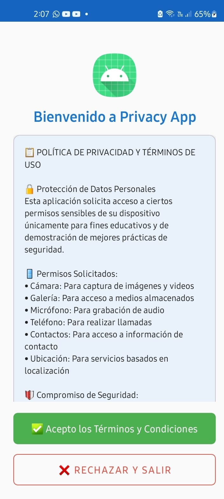
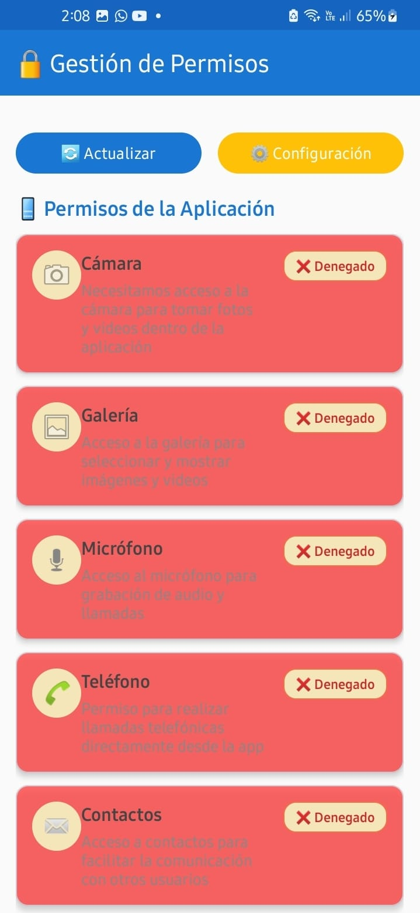
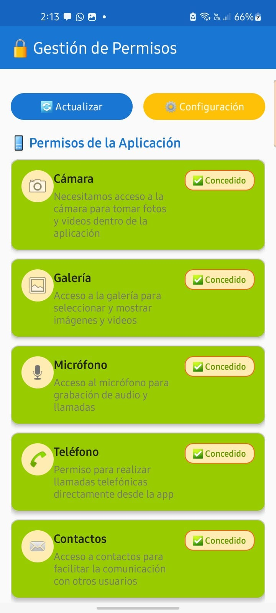
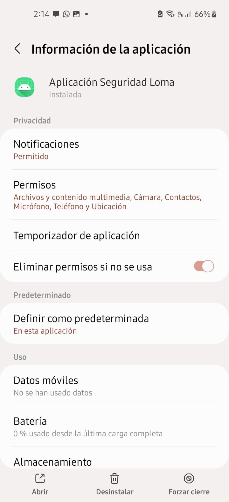

# **Aplicación Seguridad SEMANA 14**
Aplicación Android avanzada que demuestra las mejores prácticas para la gestión de permisos sensibles con política de privacidad integrada y sistema de logging completo.

## **📱 Descripción**
Esta aplicación implementa un sistema completo de gestión de permisos que incluye:
* **Política de privacidad obligatoria** antes del acceso principal
* **Gestión inteligente de 6 permisos críticos** (Cámara, Galería, Micrófono, Teléfono, Contactos, Ubicación)
* **Sistema de rationale explicativo** para permisos denegados
* **Historial completo de actividad** con timestamps y estados
* **Detección de permisos denegados permanentemente**
* **Navegación directa a configuración del sistema**

## **🚀 Características Principales**

### **🔒 Seguridad y Privacidad**
* **PrivacyPolicyActivity**: Pantalla inicial obligatoria con términos completos
* **Política GDPR compliant**: Información detallada sobre uso de datos
* **SharedPreferences seguras**: Almacenamiento de consentimiento con timestamp
* **Validación de aceptación**: No acceso sin consentimiento previo

### **📋 Gestión de Permisos**
* **6 Permisos críticos implementados**:
  - 📷 **Cámara**: Para captura de imágenes y videos
  - 🖼️ **Galería**: Acceso a medios (compatible con Android 13+)
  - 🎤 **Micrófono**: Para grabación de audio
  - 📞 **Teléfono**: Para realizar llamadas
  - 👥 **Contactos**: Acceso a información de contacto
  - 📍 **Ubicación**: Servicios basados en localización

## **💻 Uso**

### **Pantalla de confirmación**
**Aceptar condiciones**: Lee las condiciones y con aceptar podrá ingresar a la aplicación.




### **Pantalla Principal**

1. **Pantalla con los permisos**: Se muestra la pantalla y al dar clic en alguno de ellos, va a solicitar un permiso.






1. **Historial de actividad**: Podemos observar el historial de cuando dimos permiso o no.


1. **Configuraicón**: Con el botón de configuración, nos dirige a la Información de la aplicación y podemos ver todos los permisos.



### **🎯 Sistema Inteligente**
* **Activity Result Contracts**: Implementación moderna de permisos
* **Rationale personalizado**: Explicaciones contextuales para cada permiso
* **Detección de denegación permanente**: Diálogos específicos con redirect a configuración
* **Actualización automática**: Estados en tiempo real al regresar de configuración

### **📊 Logging y Monitoreo**
* **PermissionLogAdapter**: RecyclerView con historial completo
* **Timestamps precisos**: Registro de fecha y hora de cada acción
* **Estados detallados**: SOLICITADO, CONCEDIDO, DENEGADO, CANCELADO
* **Función de limpieza**: Borrado seguro del historial con confirmación

## **📋 Requisitos Técnicos**
* **Android Studio**: Hedgehog 2023.1.1 o superior
* **SDK mínimo**: API 21 (Android 5.0 Lollipop)
* **SDK objetivo**: API 34 (Android 14)
* **Kotlin**: 1.9.0+
* **Data Binding**: Habilitado
* **Material Design**: 3.0+

## **💻 Flujo de Usuario**

### **🏁 Inicio - Privacy Policy**
1. **Primera pantalla obligatoria**: Política de privacidad completa
2. **Información detallada**: Permisos, derechos del usuario, uso de datos
3. **Decisión del usuario**:
   - ✅ **Acepto**: Guarda consentimiento y navega a MainActivity
   - ❌ **Rechazo**: Cierra la aplicación inmediatamente

### **🏠 Pantalla Principal - MainActivity**
1. **Estado en tiempo real**: Visualización actual de todos los permisos
2. **Solicitud inteligente**: 
   - Muestra rationale si es necesario
   - Usa launchers apropiados (single/multiple)
   - Detecta denegaciones permanentes
3. **Controles disponibles**:
   - 🔄 **Actualizar**: Refresh manual de estados
   - ⚙️ **Configuración**: Acceso directo a ajustes del sistema
   - 🗑️ **Limpiar logs**: Borrado del historial con confirmación

### **📝 Historial de Actividad**
- **Lista en tiempo real** de todas las acciones realizadas
- **Información completa**: Tipo de permiso, acción, timestamp, notas adicionales
- **Diseño intuitivo**: Cards con iconografía clara
- **Contador dinámico**: Número total de eventos registrados

## **🔧 Arquitectura del Proyecto**

### **📂 Estructura Principal**
```
Aplicacion_Seguridad_Loma/
├── app/src/main/
│   ├── java/com/example/aplicacion_seguridad_loma/
│   │   ├── MainActivity.kt                    # Activity principal
│   │   ├── ui/
│   │   │   └── PrivacyPolicyActivity.kt      # Pantalla de política
│   │   ├── models/
│   │   │   ├── PermissionState.kt            # Estado de permisos
│   │   │   ├── PermissionType.kt             # Tipos de permisos
│   │   │   └── PermissionLog.kt              # Modelo de logs
│   │   ├── viewmodel/
│   │   │   └── MainViewModel.kt              # Lógica de negocio
│   │   └── ui/adapters/
│   │       ├── PermissionAdapter.kt          # RecyclerView permisos
│   │       └── PermissionLogAdapter.kt       # RecyclerView logs
│   ├── res/
│   │   ├── layout/
│   │   │   ├── activity_main.xml            # Layout principal
│   │   │   ├── activity_privacy_policy.xml  # Layout política
│   │   │   ├── item_permission.xml          # Item permiso
│   │   │   └── item_permission_log.xml      # Item log
│   │   ├── values/
│   │   │   ├── strings.xml                  # Textos con emojis
│   │   │   ├── colors.xml                   # Paleta de colores
│   │   │   └── themes.xml                   # Temas Material
│   │   └── mipmap/                          # Iconos de aplicación
│   └── AndroidManifest.xml                  # Configuración y permisos
└── README.md                                # Este archivo
```


## **🎨 Diseño UI/UX**

### **📱 Material Design 3.0**
* **Cards elevadas**: Para agrupación visual de contenido
* **Botones Material**: Con diferentes variantes (filled, outlined, text)
* **NestedScrollView**: Scroll fluido y responsivo
* **RecyclerViews**: Listas optimizadas para rendimiento
* **Typography**: Escala tipográfica Material coherente

### **🎨 Sistema de Colores**
```xml
Paleta principal:
├── Primary: Azul corporativo (#1976D2)
├── Secondary: Verde acción (#4CAF50) 
├── Error: Rojo advertencia (#F44336)
├── Success: Verde confirmación (#4CAF50)
└── Background: Neutral claro (#F5F5F5)
```


## **🔐 Características de Seguridad**

### **🛡️ Privacy by Design**
1. **Consentimiento informado**: Política completa antes del acceso
2. **Transparencia total**: Explicación detallada de cada permiso
3. **Control del usuario**: Posibilidad de revocar en cualquier momento
4. **Almacenamiento mínimo**: Solo datos esenciales en SharedPreferences
5. **No tracking**: Sin recolección de datos personales

### **📋 Compliance GDPR**
- ✅ **Derecho a la información**: Política clara y accesible
- ✅ **Derecho al consentimiento**: Aceptación explícita requerida
- ✅ **Derecho de acceso**: Usuario puede ver qué permisos están activos
- ✅ **Derecho de rectificación**: Puede cambiar permisos en cualquier momento
- ✅ **Derecho al olvido**: Función de limpieza de datos

## **⚡ Rendimiento y Optimización**

### **🚀 Optimizaciones Implementadas**
* **ViewBinding**: Eliminación de findViewById para mejor rendimiento
* **LiveData**: Actualizaciones reactivas eficientes
* **RecyclerView.ListAdapter**: DiffUtil para actualizaciones optimizadas
* **Coroutines**: Operaciones asíncronas sin bloqueo de UI
* **Lazy initialization**: Carga bajo demanda de componentes

### **💾 Gestión de Memoria**
* **Lifecycle awareness**: ViewModels respetan el ciclo de vida
* **Weak references**: Evitan memory leaks
* **Efficient layouts**: ConstraintLayout para jerarquías planas
* **Resource optimization**: Drawables vectoriales para múltiples densidades

## **🧪 Testing y Calidad**

### **🔍 Casos de Prueba Sugeridos**
1. **Flujo completo**: Privacy Policy → MainActivity → Permisos → Logs
2. **Denegación permanente**: Verificar navegación a configuración
3. **Rotación de pantalla**: Persistencia de datos y estado
4. **Múltiples sesiones**: Validación de SharedPreferences
5. **Compatibilidad**: Diferentes versiones de Android

